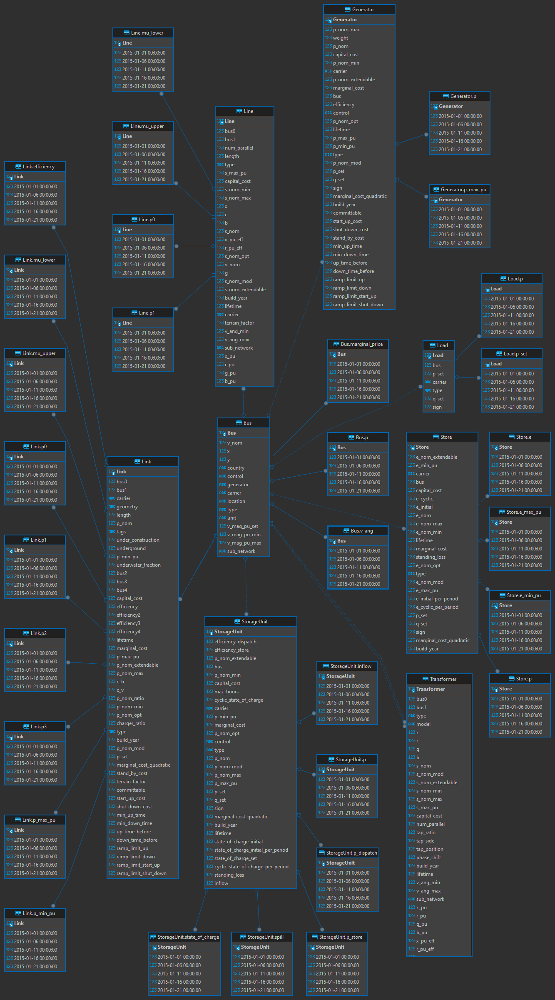

# Explanations

This part of the project documentation focuses on an
**understanding-oriented** approach. You'll get a
chance to read about the background of the project,
as well as reasoning about how it was implemented.

> **Note:** Expand this section by considering the
> following points:

- Give context and background on your library
- Explain why you created it
- Provide multiple examples and approaches of how
    to work with it
- Help the reader make connections
- Avoid writing instructions or technical descriptions
    here

## Dependencies

The package esmtools uses a variety of inputs from PyPSA model runs.

### Folder Structure

* results folder
* scenario subfolder
* resource folder
* interpolated data folder

### Input Files

* (post)networks
* config.yaml
* nodal_energy.csv
* industry.csv
* costs.csv

### The postnetwork

* FK-relations (and their exceptions)

### PyPSA Statistics

* explain reindex operation and groupers.
* explain statistics local functions
* explain aggregation functions: aggregate_time and aggregate_components

### esmtools Concept and Workflow

1. fetch statistics via esmtools.statistic.collect_myopic_statistics
2. combine statistics to a metric
3. configure metric for export
4. export metric
